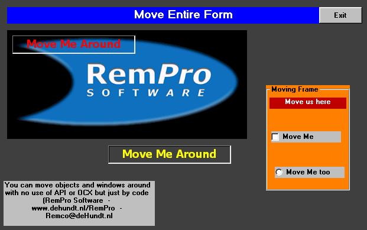



## Dragging Forms and Objects with Ease

### Description

This Code shows how very, very, very easy it is to drag Forms, Labels, Images, Frames (and what more around your screen by a mouseclick and moving in real time without API, OCX, Functions or other than pure and very simple code. Programming is not always a difficult job.... TRY IT ! and vote (or not if you don't like the code !
 
### More Info
 
no adds needed

it really works!

             |
---                |---
**Submitted On**   |2002-08-20 23:58:30
**By**             |[Remco de Hundt](https://github.com/Planet-Source-Code/PSCIndex/blob/master/ByAuthor/remco-de-hundt.md)
**Level**          |Intermediate
**User Rating**    |4.6 (32 globes from 7 users)
**Compatibility**  |VB 6\.0
**Category**       |[Coding Standards](https://github.com/Planet-Source-Code/PSCIndex/blob/master/ByCategory/coding-standards__1-43.md)
**World**          |[Visual Basic](https://github.com/Planet-Source-Code/PSCIndex/blob/master/ByWorld/visual-basic.md)
**Archive File**   |[Dragging\_F1204558202002\.zip](https://github.com/Planet-Source-Code/remco-de-hundt-dragging-forms-and-objects-with-ease__1-38131/archive/master.zip)

### API Declarations

NO API

